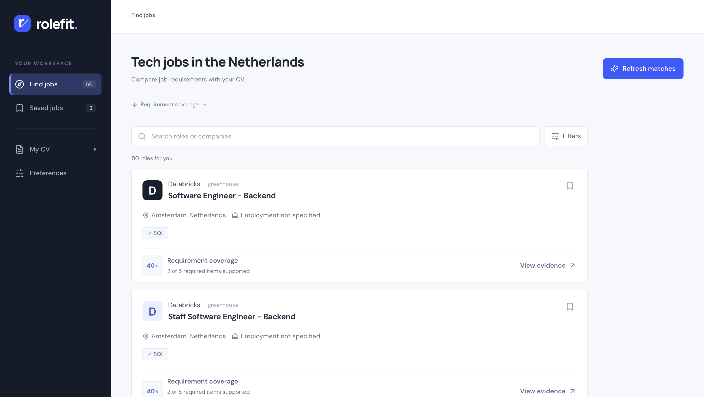
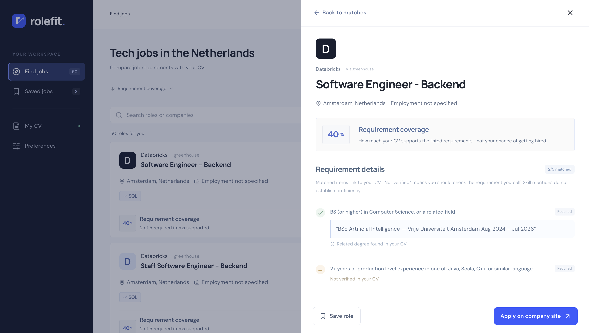

# RoleFit

Find AI, data and software jobs in the Netherlands and compare their requirements with evidence from your CV.



## Features

- Upload a PDF, DOCX or TXT CV.
- Filter jobs by role, career level and employment preferences.
- Review matched requirements alongside exact CV passages.
- Save jobs and apply on the employer’s website.

**Built with:** Next.js, TypeScript, Python, FastAPI and SQLite/PostgreSQL.

## Run locally

Requires Python 3.12+ and Node.js 22+. From the repository root:

```sh
make setup
make refresh
```

Then run these in **separate terminals**:

```sh
make run-api
```

```sh
make run-web
```

Open [localhost:3002](http://127.0.0.1:3002). No account or paid API key is needed locally.

For a fictional demo without the backend, run `npm ci --prefix web` followed by `make demo`.

## How matching works

Rules extract requirements from job descriptions and look for supporting skills and degrees in your CV. The score measures **requirement coverage, not hiring probability**. Skill mentions do not prove proficiency, and complex requirements may need manual review. Scanned PDFs require OCR first. Matching accuracy is partially reviewed.



## Checks and documentation

Run `make check` for backend tests, linting, frontend checks and a production build.

- [Developer guide](docs/development.md) — setup, architecture, matching details and troubleshooting.
- [Validation notes](docs/validation.md) — what has been tested and remaining limitations.
- [Privacy notes](docs/retention.md) — how CV data is handled.

[MIT License](LICENSE)
