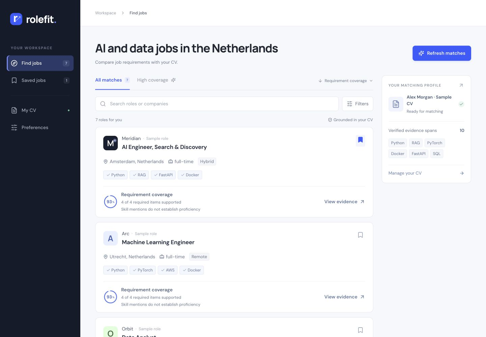
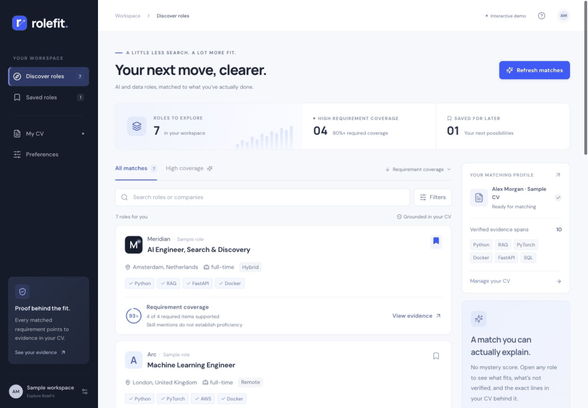
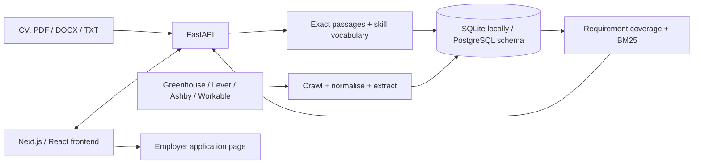

# RoleFit

A local portfolio app for exploring AI and data jobs with evidence from your CV.

Upload a CV, set role and country preferences, and explore public vacancies ranked by **requirement coverage**. Open a role to see exact CV passages behind skill matches, requirements that need manual review, and the original application link.



## Try it

Requires Python 3.12+ and Node.js 22+. Run from the repository root.

```sh
make setup
make refresh
```

Then use two terminals:

```sh
make run-api
```

```sh
make run-web
```

Open **http://127.0.0.1:3002**. The API runs at **http://127.0.0.1:8000**; its interactive documentation is at **/docs**. The API root is not the frontend.

SQLite is used by default, with the database in the ignored `work/` folder. No accounts, paid API keys or model downloads are needed. An optional `.env` can override settings; see `.env.example`.

For an existing checkout, run `.venv/bin/alembic upgrade head` before starting the API. Back up your local database before migrations. `make refresh` updates public jobs; it does not need a CV.

### Fictional demo without the backend

```sh
cd web
npm ci
cd ..
make demo
```

Open the same frontend URL. Stop any previous frontend with Ctrl+C first. The demo contains fictional companies and a fictional CV; PDF/DOCX parsing requires the backend. Demo preferences and saved sample IDs persist in the browser, but pasted CV text stays in memory.



## How matching works

1. **Parse the CV.** Read PDF, DOCX or TXT and retain exact text passages with their offsets and sections. Scanned PDFs need a text layer.
2. **Extract requirements.** Recognise qualification sections and map explicit skills through a small reviewed vocabulary. Preserve other requirements as unverified instead of silently discarding them.
3. **Match mentions.** Link recognised skills to exact CV passages. A mention is not proof of proficiency, production experience or every condition in a job sentence.
4. **Calculate coverage.** Required items carry 85% and preferred items 15%. If only one group is present, it carries 100%. No extracted requirements means **no score**, not 0%.
5. **Order results.** Coverage first, BM25 text overlap for ties. Country, role family and employment type are filters; workplace preference can reorder the displayed results.

Degree, relevant experience and other complex requirements remain **“Not verified in your CV”** for manual review. This does not mean the candidate lacks them. Senior roles and limited extractions have visible reminders to inspect the original posting.

The score is **not a hiring probability, eligibility decision or validated suitability rating**.

## Architecture



| Folder | Purpose |
| --- | --- |
| `api/` | API, parsing, matching, crawlers, authentication and migrations |
| `web/` | Responsive frontend and fictional demo |
| `data/` | Public job-board sources, reviewed vocabulary, fictional CV |
| `tests/` | Backend regression tests |
| `scripts/` | Smoke test and optional scheduled crawl |
| `docs/` | Validation notes, portfolio walkthrough, screenshots, archived research plans |

## Validation and scope

- Tested parsing and application flows with **three user-supplied CVs**, kept out of Git.
- AI-assisted qualitative review of **15 CV–job pairs** (five per profile), including internships, senior roles and extraction failures. This is not an independent human benchmark or a measured ranking-accuracy claim.
- Regression tests cover scoring edge cases, exact evidence spans, user isolation, CV replacement/deletion, legacy caches, source failures and localhost-only development authentication.
- Browser checks cover desktop/mobile layouts, upload, matching, preferences, empty results, save/skip, application links and backend errors.

See [validation details](docs/validation.md) and the [portfolio walkthrough](docs/portfolio.md).

## Commands

| Command | Purpose |
| --- | --- |
| `make demo` | Fictional frontend demonstration on port 3002 |
| `make run-api` | Local API on port 8000 |
| `make run-web` | Frontend connected to the local API |
| `make refresh` | Crawl sources, extract requirements, print a summary |
| `make crawl` / `make extract` | Run either refresh stage separately |
| `make check` | Python tests/lint, demo tests, TypeScript, frontend lint/build |
| `.venv/bin/alembic upgrade head` | Update the database schema |

Refresh summaries are written to ignored `work/yield.json`. A failed board is reported and its existing jobs are preserved. Partial refreshes exit with a nonzero status so failures are visible.

The optional `scripts/smoke_api.py` should run against a **disposable database**; it refuses to replace an existing CV.

## Limitations

- English-oriented, rule-based extraction misses unusual headings and layouts. Always read the original posting; some jobs have no score.
- Skill aliases and keyword mentions cannot prove expertise. Alternatives such as “Python or R” are not fully modelled, and repeated or compound requirements may affect weighting.
- Years of relevant experience, degree completion/subject, clearance and similar constraints require manual review.
- Jobs come from a selected set of public boards, not the whole job market. Refresh data before demonstrating current vacancies.
- The fictional demo is illustrative; it is not a benchmark of the backend.
- This is a **local portfolio MVP**, not a deployed recruitment service. Production sign-in and private-data operations have not been validated as a hosted service.

## Privacy and deployment

Original uploads are discarded after parsing. Extracted text and evidence remain in the local database until replaced or deleted. Databases, real CVs and credentials are ignored by Git. See [retention notes](docs/retention.md).

Normal local use does not send CVs to a model provider. Optional `LLM_*` settings enable external extraction; leave them empty for private local testing. Enabling them sends CV text to the configured provider.

Development authentication is restricted to loopback clients and localhost URLs/origins. Do not expose it publicly. The optional Docker/PostgreSQL recipe requires real authentication for API access; it is not the supported no-account quickstart. Public hosting and production account setup are separate work.

## Troubleshooting

- **Port busy:** stop the previous RoleFit terminal with Ctrl+C; do not stop unrelated projects. Default frontend port is 3002 to avoid common port-3000 conflicts.
- **API shows “Not Found”:** open port 3002 for the app; port 8000 is the API.
- **Could not reach RoleFit:** start `make run-api` and check `http://127.0.0.1:8000/health`.
- **No jobs:** run `make refresh` and broaden country/role filters.
- **File-watcher errors on macOS:** the Makefile enables polling for the frontend.
- **Changed demo/connected mode:** stop and restart the frontend with the appropriate Makefile command.

MIT licensed. Earlier research plans are preserved in [docs/archive](docs/archive/README.md); they are not claims of completed experiments.

Choose **Work location** above the job list to filter by country (including the Netherlands and Greece), or select several countries in **Filters**. Results depend on the configured job feeds; an empty country has no matching imported listings. Remote roles keep their listed country restrictions.

European feeds include Eye Security (Netherlands), Quality & Reliability, and YourHero / Douleutaras (Greece). Workable imports use its [documented public jobs endpoint](https://workable.readme.io/reference/jobs-1). Run `make refresh` to update listings; country availability still depends on open roles and your employment filters.
