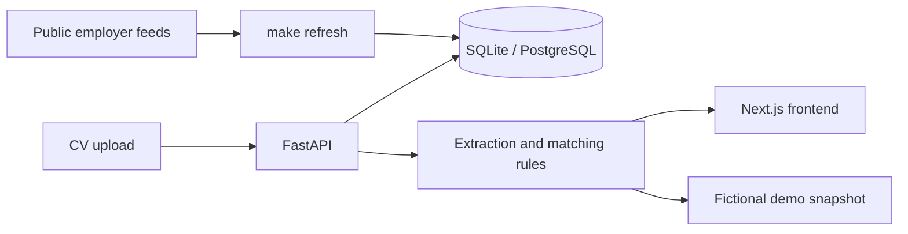

# Developer guide

[Back to RoleFit](../README.md)

## Run locally

Requires Python 3.12+ and Node.js 22+. From the repository root:

```sh
make setup
make refresh
```

Run these in separate terminals:

```sh
make run-api
```

```sh
make run-web
```

Open **http://127.0.0.1:3002**. The API runs on port 8000; `/docs` is its API documentation. SQLite data stays in the ignored `work/` directory. Local development needs no account or paid API key.

After updating an existing checkout, stop the API, back up your database, then run:

```sh
.venv/bin/alembic upgrade head
make run-api
```

The cleanup migration keeps CVs, jobs and bookmarks, merges older AI preferences, and removes obsolete extraction caches, budgets and skipped decisions. Previously hidden jobs become visible again. Historical migration IDs remain supported; fresh installs no longer require pgvector. Migration downgrades do not recover deleted caches or skipped decisions.

## Fictional demo

```sh
cd web
npm ci
cd ..
make demo
```

The demo uses a fixed fictional CV and jobs. Its results are generated with the **same Python extraction and matching code as the API**, rather than a second browser matching engine. Preferences and saved sample IDs persist in local browser storage. Uploading your own CV requires the connected app.

Run `make demo-data` after changing matching, role groups, vocabulary or fictional fixtures. `make check` rejects an out-of-date demo fixture. Keep real CV text and personal details out of fixtures and screenshots.

## Matching

1. Parse a text-based PDF, DOCX or TXT into exact passages. Scanned PDFs need OCR first.
2. Extract candidate requirements from recognised qualification sections and a reviewed skill vocabulary.
3. Match basic skill mentions and supported computing degrees. AI is a related computing field where the posting permits one; degree level and completion dates are checked separately.
4. Score required requirements at 85% and preferred ones at 15%, reweighting when only one group exists. No extracted requirements means no score.
5. Sort by coverage, with BM25 text overlap as a tiebreaker. Users can also sort by newest posting.

“Not verified” does not mean a candidate lacks a skill. Proficiency, specialised experience, alternatives and complex requirements still need review. Exact quotations verify the source of a claim, not its truth. Accuracy is **partially reviewed**, not scientifically validated.

## Scope

- Netherlands availability only, including remote jobs explicitly open there.
- English-language listings from the public employer feeds in `data/seeds.json`.
- AI/ML, data, software, automation, solutions, consulting and analyst roles.
- **AI Consulting & Solutions** includes AI consulting, implementation, adoption and AI solutions titles. Old preference names are mapped automatically.
- Career level comes from explicit title cues. An unmarked title is “Not specified”. Internship is selected under employment type and is not excluded by a regular-job career filter.
- Unknown employment is shown as “Not specified”, not guessed. Work arrangement is optional.
- Sources refresh only when `make refresh` runs. A failed board does not close its stored vacancies.

No LinkedIn/Indeed scraping, pasted jobs, city filters, notifications, model extraction, skip lists or automatic background crawler. Available categories do not guarantee current vacancies.

## Code layout



| Location | Purpose |
| --- | --- |
| `api/rolefit/` | API, rules, CV parsing and job ingestion |
| `api/alembic/` | Database migrations, including upgrades from earlier versions |
| `web/app/page.tsx` | Application state and navigation |
| `web/components/` | Job cards/details, CV profile and preferences |
| `web/styles/` | Base, workspace, forms, details and responsive styles |
| `web/lib/demo-data.json` | Generated fictional results |
| `data/` | Sources, skill vocabulary and fictional fixture inputs |
| `tests/` | Matching, isolation, ingestion, migration and API regressions |

## Checks and commands

| Command | Purpose |
| --- | --- |
| `make check` | Demo consistency, Python tests/lint, frontend tests/types/lint/build |
| `make refresh` | Fetch jobs, extract requirements and report source failures |
| `make demo-data` | Regenerate fictional demo results |
| `make demo` | Start the standalone demo |
| `make up` | Optional PostgreSQL/Docker setup; requires real authentication |

[Validation notes](validation.md) distinguish automated tests, browser checks and manual matching review. [Portfolio notes](portfolio.md) include a short presentation and CV bullet.

## Privacy and deployment

CV parsing and matching run locally in the backend; there is no external model provider. Original uploads are discarded after parsing. Retained text and evidence can be deleted or replaced. See [retention notes](retention.md).

Local development authentication is restricted to loopback requests and localhost origins. Supabase authentication, account isolation, database migrations and CI remain available for a future hosted version. Public deployment still needs operational configuration and a privacy review; the Docker recipe is not the no-account quickstart.

## Troubleshooting

- **Port busy:** stop the previous RoleFit process with Ctrl+C, without stopping other projects.
- **API says Not Found:** the site is on port 3002, not 8000.
- **Old role options rejected:** restart the API after applying migrations.
- **No jobs:** run `make refresh`, then check preferences and include unspecified employment if appropriate.
- **Switch demo/connected mode:** restart the frontend using the corresponding Makefile command.

MIT licensed. [Archived research plans](archive/README.md) are historical proposals, not completed experiments.
